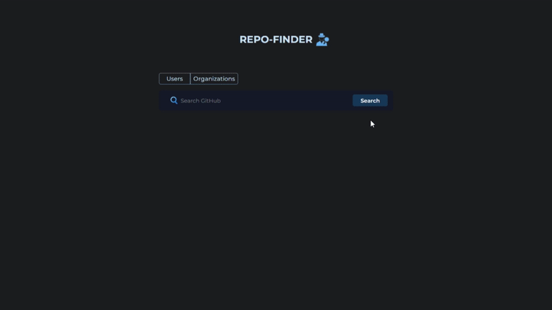

# Repo Finder 🔍

A simple web app to search GitHub repositories by name.  
Built with **HTML5**, **Sass**, and **JavaScript (ES6 modules)**, bundled using **Parcel**.  

---

## 🚀 Demo
👉 [Live Demo on GitHub Pages](https://gamalhafez.github.io/repo-finder/)

---

## 📸 PreView

---

## ✨ Features
- 🔎 Search any GitHub repository by name  
- ⚡ Fast, responsive UI  
- 🎨 Styled with Sass and clean BEM methodology  
- 📦 Bundled with Parcel for easy development & deployment  

---

## 🛠️ Tech Stack
- **HTML5**  
- **Sass** (with BEM methodology)  
- **JavaScript (ES6 Modules)**  
- **Parcel** (for bundling & dev server)  
- **GitHub Pages** (for deployment)  
